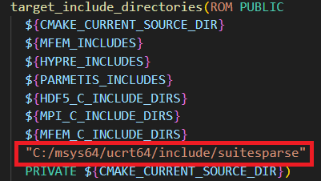
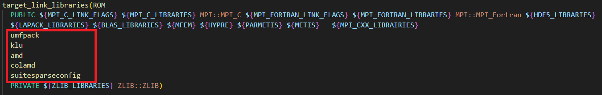

# Introduction to Order Reduction

This section focuses on reducing the model size using the Proper Orthogonal Decomposition (POD) method.

Since the POD algorithm relies on techniques such as Singular Value Decomposition (SVD), we include an external library in the project.

We chose to use [libROM](https://www.librom.net/) as it is directly compatible with [MFEM](https://mfem.org/), the core finite element library used in this project.

---

## libROM on Windows Using MSYS2

This guide provides step-by-step instructions to easily compile and use libROM on a Windows machine. One of the simplest ways to do so is to use the [MSYS2](https://www.msys2.org/) package manager.

> It is **strongly recommended** that MFEM has already been compiled using CMake and the UCRT64 environment of MSYS2, as libROM requires parallel computing with MPI.
>  
> If not, refer to the `README.md` file in the root of this repository — it includes a quick guide for building MFEM under MSYS2.

We assume that all packages required for MFEM, including MPI and SuiteSparse, are already installed.

---

### Step-by-Step Guide

In addition to the packages needed for MFEM, libROM requires a few more. You can install them using the UCRT64 environment in MSYS2:

```bash
pacman -S mingw-w64-ucrt-x86_64-gcc-fortran
pacman -S mingw-w64-ucrt-x86_64-hdf5
pacman -S mingw-w64-ucrt-x86_64-scalapack
```

Then, clone the libROM GitHub repository:

```bash
git clone https://github.com/LLNL/libROM.git
```

---

### Configuring libROM

If MFEM was built from source using CMake and not installed via MSYS2 packages, you may need to manually edit libROM's CMake files. In particular, modify:

```bash
libROM/lib/CMakeLists.txt
```

#### Include SuiteSparse Headers

In the `target_include_directories` section, add the path to SuiteSparse headers. By default, it's:

```bash
C:/msys64/ucrt64/include/suitesparse
```



#### Link Required SuiteSparse Libraries

In the `target_link_libraries` section, add the following libraries:

```cmake
  umfpack
  klu
  amd
  colamd
  suitesparseconfig
```



---

### Building libROM

Now, create a build directory and move into it:

```bash
cd libROM
mkdir build
cd build
```

Configure the project using `cmake`. Here's an example command (adjust the paths if needed):

```bash
cmake 
  -DUSE_MFEM=YES 
  -DMFEM_INCLUDES="C:/Program Files (x86)/mfem/include" 
  -DMFEM="C:/Program Files (x86)/mfem/lib/libmfem.a"
  -DENABLE_EXAMPLES=NO 
  ..
```

These paths correspond to a default MFEM installation done using `CMake` and `ninja install`.

Finally, compile and install libROM:

```bash
ninja install
```

---

### Final Note

Once libROM is successfully compiled, you can run the code of this project using the order reduction.

For more information, refer to the official [libROM documentation](https://librom.readthedocs.io/en/latest/).