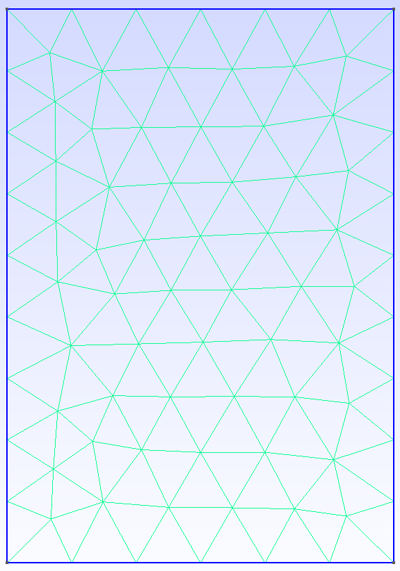

# Définition du problème

L'objectif ici est de modéliser les pertes par courants de Foucault dans une ferrite, dans des applications d'électronique de puissance. Les hypothèses ainsi que les équations résolues sont définies dans l'article suivant :

## Modèle 2D

La modélisation 2D se base sur un maillage rectangulaire simple, qui est possible grâce à l'axisymétrie angulaire du problème. Le maillage est représenté ci-dessous.

!

